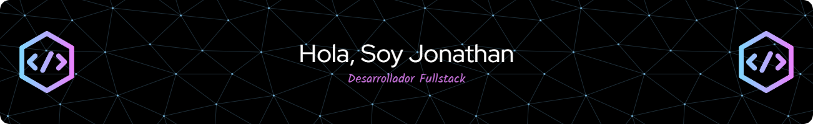

*** 
 
# 💫 About Me:
 

 
¡Hola, soy Jonathan! 👋  👨‍💻 Soy un apasionado de la programación que acaba de salir de un bootcamp donde aprendí a domar React y Java con Springboot.  🛠 Proyectos Chulos: Mi orgullo y alegría es un proyecto de escape room que he creado, ¡una aventura llena de acertijos y diversión!  🤝 Team Player: Me encanta trabajar en equipo y siempre estoy dispuesto a echar una mano. ¡Nada me gusta más que aprender cosas nuevas y compartir conocimientos!  🚀 Busco Oportunidades: Estoy en la búsqueda de mi primera aventura laboral en el mundo tech.  ¡Echa un vistazo a mis repos y si te apetece colaborar o tienes una oportunidad, no dudes en contactar conmigo!

## 🌐 Socials:

# 💻 Tech Stack:
 
               

# 📊 GitHub Stats:
 
 

---

